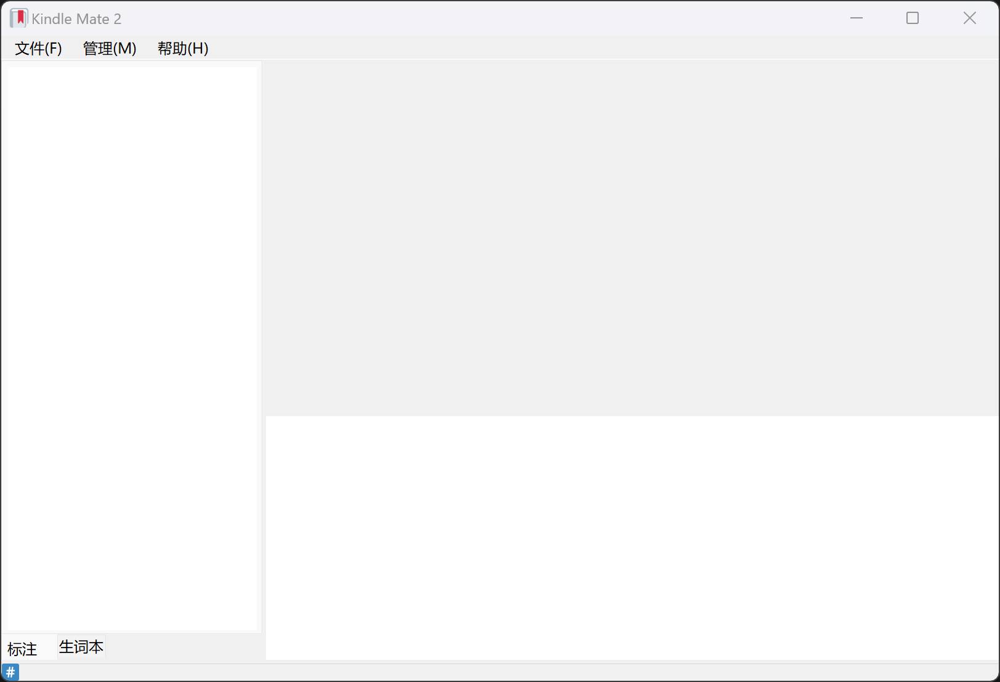
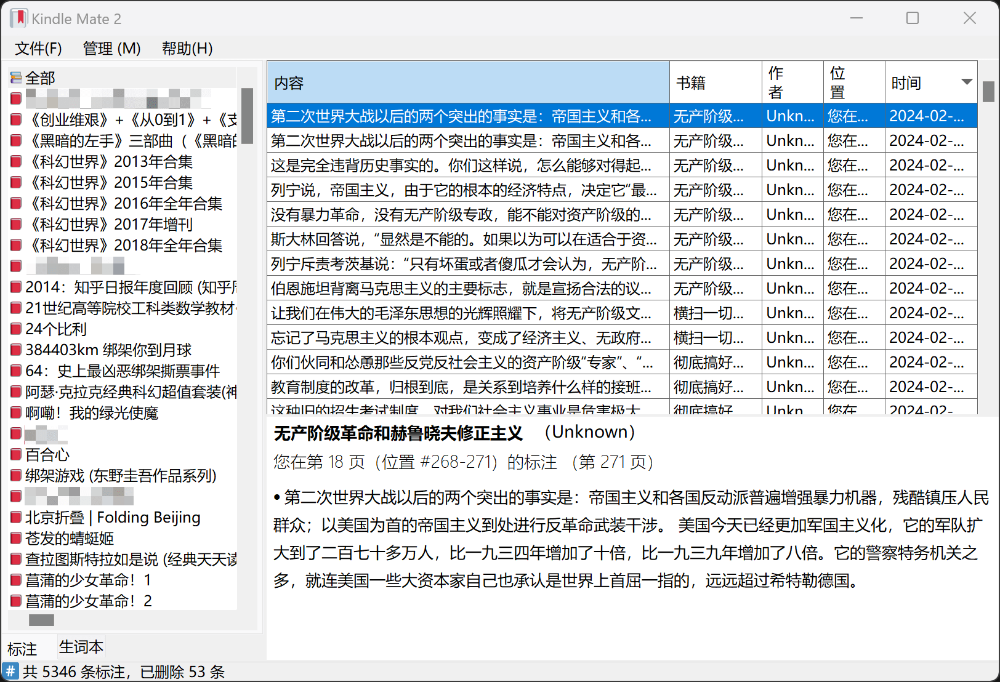

# KindleMate2

 &ensp; 

**Kindle Mate 2** 是一款Kindle标注/笔记、Kindle生词本内容管理程序，旨在为 [Kindle Mate](https://web.archive.org/web/20231205072358/https://kmate.me/) 停止更新后提供替代方案。

**Kindle Mate 2** is a program for managing Kindle's clippings/notes and Kindle's vocabulary list, aiming to provide an alternative solution after the [Kindle Mate](https://web.archive.org/web/20231205072358/https://kmate.me/) stopped updating.

## System Requirements

- **Minimum**: `Windows 7` or later
- **Recommended**: `Windows 11`
- **Architecture**: `x86` or `x64`.

[.NET Desktop Runtime 8.0](https://dotnet.microsoft.com/en-us/download/dotnet/8.0) required for runtime dependent version.

## Features

- [x] 导入“My Clippings.txt”
- [x] 导入“vocab.db”
- [x] 同步已连接的Kindle设备
- [x] 编辑标注
- [x] 编辑生词本
- [x] 导出功能
- [ ] 分享功能
- [ ] ……

## Screenshots

