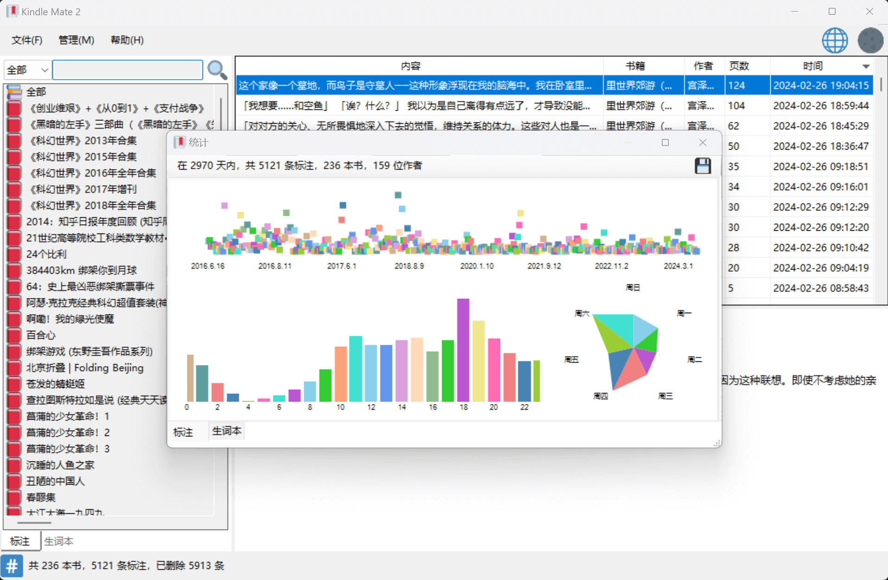
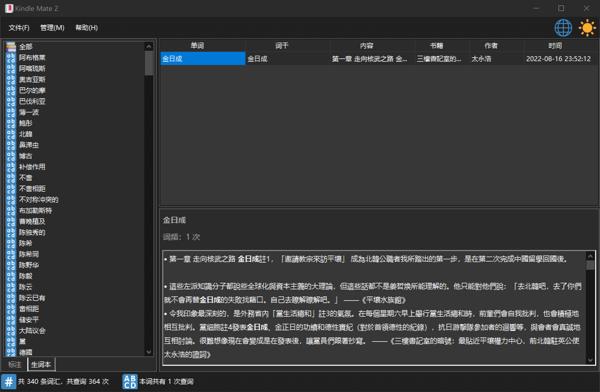
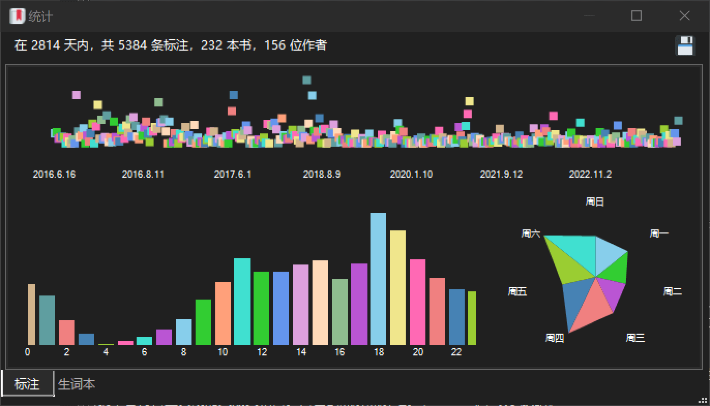

# KindleMate2

 &ensp; 

**Kindle Mate 2** 是一款Kindle标注/笔记、Kindle生词本内容管理程序，旨在在 [Kindle Mate](https://web.archive.org/web/20231205072358/https://kmate.me/) 停止更新后提供替代的解决方案。

**Kindle Mate 2** is a program for managing Kindle's clippings/notes and Kindle's vocabulary list, aiming to provide an alternative solution after the [Kindle Mate](https://web.archive.org/web/20231205072358/https://kmate.me/) stopped updating.

## System Requirements

- **Minimum**: `Windows 7` or later
- **Recommended**: `Windows 11`
- **Architecture**: `x86` or `x64`.

[.NET Desktop Runtime 8.0](https://dotnet.microsoft.com/en-us/download/dotnet/8.0) required for runtime dependent version.

## Building

Visual Studio & C#

### Submodules

Do `git submodule update --init --recursive` first after cloning this repo.

- [`lzcapp/Dark-Mode-Forms`](https://github.com/lzcapp/Dark-Mode-Forms): forked from [`BlueMystical/Dark-Mode-Forms`](https://github.com/BlueMystical/Dark-Mode-Forms)

### Projects

- KindleMate2 (WinForm): Current version.
- KindleMate2_WPF (WPF): Not yet done, much work to do.

## Features

- [x] 导入标注（`My Clippings.txt`）
- [x] 导入生词本（`vocab.db`）
- [x] 同步已连接的Kindle设备
- [x] 编辑标注
- [x] 编辑生词本
- [x] 清理功能
- [x] 导出功能
- [x] 统计功能
- [x] 夜间模式（深色模式）
- [x] 语言切换
- [ ] 分享功能（？）

## Screenshots

## Star History

<a href="https://star-history.com/#lzcapp/KindleMate2&Date">
 <picture>
   <source media="(prefers-color-scheme: dark)" srcset="https://api.star-history.com/svg?repos=lzcapp/KindleMate2&type=Date&theme=dark" />
   <source media="(prefers-color-scheme: light)" srcset="https://api.star-history.com/svg?repos=lzcapp/KindleMate2&type=Date" />
   
 </picture>
</a>
