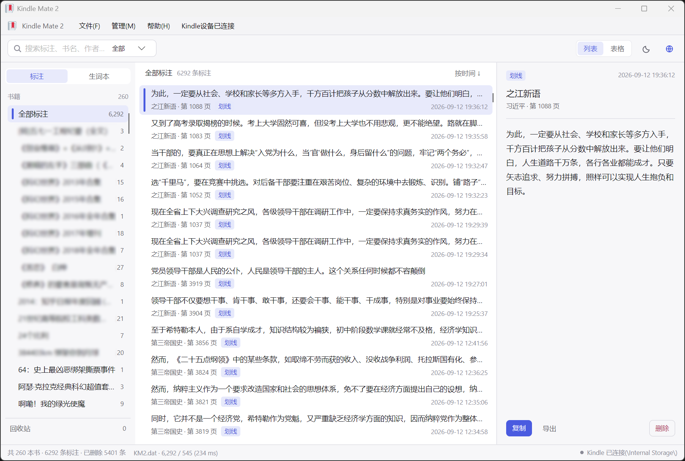
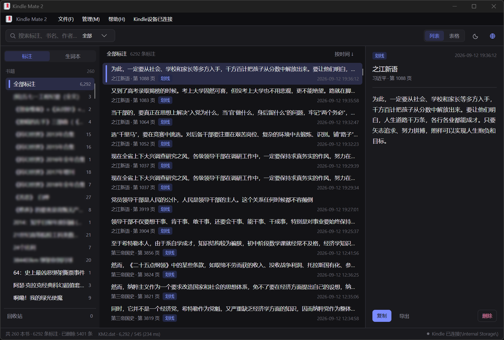
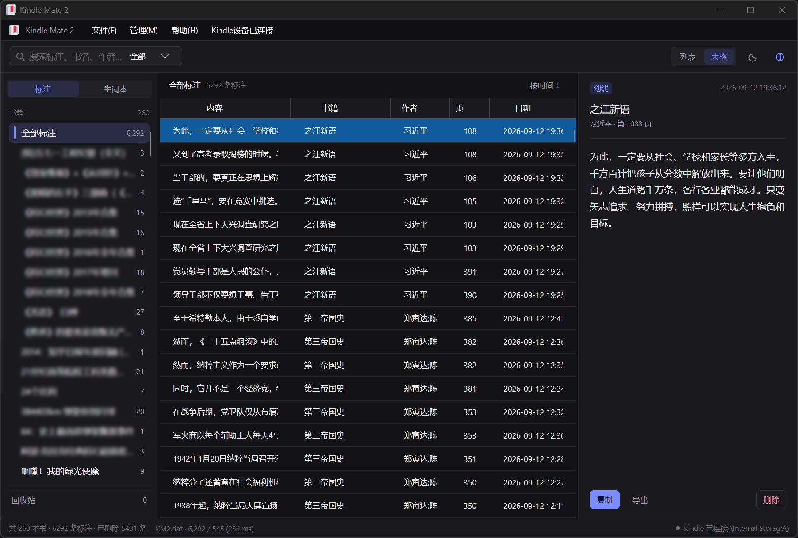
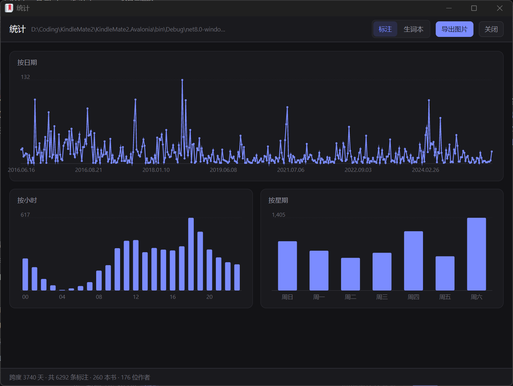
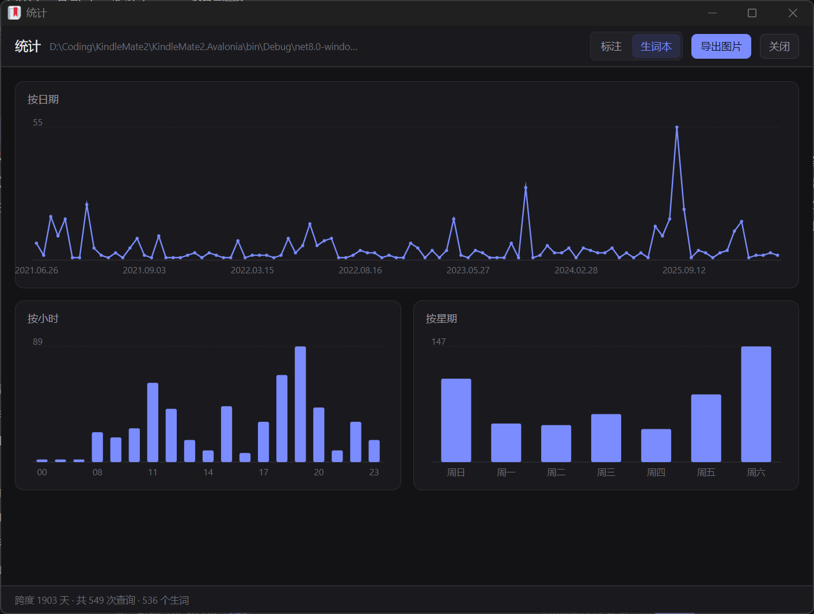

# Kindle Mate `2`


[](https://github.com/lzcapp/KindleMate2?tab=MIT-1-ov-file) &ensp; [](https://github.com/lzcapp/KindleMate2/releases/latest) &ensp; [
](https://github.com/lzcapp/KindleMate2/releases)

**Kindle Mate 2** 是一款Kindle标注/笔记、Kindle生词本内容管理程序，旨在在 [Kindle Mate](https://web.archive.org/web/20231205072358/https://kmate.me/) 停止更新后提供替代的解决方案。

**Kindle Mate 2** is a program for managing Kindle's clippings/notes and Kindle's vocabulary list, aiming to provide an alternative solution after the [Kindle Mate](https://web.archive.org/web/20231205072358/https://kmate.me/) stopped updating.

**README** &ensp; [](#) &ensp; [](README.en.md)

## 系统要求

- **Windows**：`Windows 10 1809` 或更高（.NET 10 的要求）—— `KindleMate2_{arm64,x64,x86}[_runtime].zip`
- **macOS**：`macOS 11`（Apple Silicon）/ `macOS 10.15`（Intel）或更高 —— `KindleMate2_macos-{arm64,x64}.dmg`
- **Linux**：`KindleMate2_{linux-x64,linux-arm64}[_runtime].tar.gz`
- **架构**: `x86` 或 `x64` 或 `ARM64`
- **三个平台的 Kindle 设备同步均已支持**（USB 大容量存储 + MTP）：Windows 原生支持 MTP；macOS 包里内嵌 libmtp（见下方「第三方组件」）；Linux 走系统自带的 libmtp（见下）

依赖运行时（runtime）的版本需要安装对应平台的 [.NET 10 运行时](https://dotnet.microsoft.com/en-us/download/dotnet/10.0)（Windows 需 Desktop Runtime）；文件名带 `_runtime` 的是**自包含**包，无需安装。macOS 只提供自包含包。

### 下载与运行

Windows / Linux 各提供两种包：带 `_runtime` = **自包含**（免装 .NET 运行时）；不带该后缀 = 需先安装上面的运行时。

- **Windows**：解压 `.zip` 后运行 `KindleMate2.Avalonia.exe`（64 位系统取 `KindleMate2_x64[_runtime].zip`）；库文件建在程序所在目录（与旧版一致）
- **Linux**：解压后运行 `./kindlemate2` —— 启动器会自动切到数据目录再拉起程序，不必手动 `cd`
  ```bash
  mkdir -p ~/KindleMate2 && tar -xzf KindleMate2_linux-x64_runtime.tar.gz -C ~/KindleMate2
  ~/KindleMate2/kindlemate2
  ```
  库文件在 `~/.local/share/KindleMate2/`（遵守 XDG，可用环境变量 `KINDLEMATE2_HOME` 覆盖）。
  归档已保留可执行位；若用图形化解压工具导致权限丢失，`chmod +x kindlemate2 KindleMate2.Avalonia` 即可。
  > **从旧版 tar.gz 升级**：旧库还在原解压目录，先搬一次 ——
  > `mkdir -p ~/.local/share/KindleMate2 && cp 旧目录/KM2.dat ~/.local/share/KindleMate2/`
- **macOS**：打开 `.dmg`，把 `KindleMate2.app` 拖进 Applications。产物**未做公证**（无 Apple 开发者账号），
  首次启动需清除隔离标记，或右键应用选「打开」：
  ```bash
  xattr -dr com.apple.quarantine "/Applications/KindleMate2.app"
  ```
  库文件固定在 `~/Library/Application Support/KindleMate2/`。

## 构建

需要 .NET SDK 10 或更高（Avalonia 12 的 XAML 源生成器要求 Roslyn ≥ 4.14；
在 SDK 8/9 上它会被 Roslyn **静默跳过**，表现为满屏 `CS0103: The name 'InitializeComponent' does not exist`）。

```bash
dotnet build KindleMate2.sln -c Debug
dotnet test  KindleMate2.Tests/KindleMate2.Tests.csproj
```

> **本仓库不含任何 git 子模块**（`DarkModeForms` 子模块随旧壳一并退役，无需 `submodule update`）。

### 项目

解决方案含 8 个工程：`Shared` / `Domain` / `Infrastructure` / `Application` /
`Devices.Windows` / `Devices.MacOS` / `Avalonia`（**唯一桌面 UI**）/ `Tests`。分层与依赖关系见 [`arch.md`](arch.md)；
壳自身的构建、运行与无头自检见 [`KindleMate2.Avalonia/README.md`](KindleMate2.Avalonia/README.md)。

> 早期基于 Windows Forms / WPF 的两个壳已退役。需要对照旧版行为时，可用只读 tag **`winforms-final`**
> （如 `git show winforms-final:KindleMate2/FrmMain.cs`）；可直接使用的旧版见 Release **`2026.09.07`**
> （WinForms，单文件免安装）。
    
    
      
    

## 特性

- [x] 导入标注（`My Clippings.txt`）
- [x] 导入生词本（`vocab.db`）
- [x] 导入 Kindle Mate 数据库（迁移旧库）
- [x] 导入 Kindle Mate 2 数据库（`KM2.dat`，把别处一份库合并进来）
- [x] 导入 KMate 数据库（`km3.dat`）
- [x] 从已连接的 Kindle 设备导入（标注 + 生词本）
- [x] 同步到已连接的 Kindle 设备
- [x] 编辑标注
- [x] 编辑生词本
- [x] 删除（单条 / 整本书 / 某个词）与**回收站**（删除可恢复）
- [x] 重命名书籍（书名 + 作者）
- [x] 清理 / 重建 / 备份 / 清空数据库
- [x] 导出为 Markdown
- [x] 统计功能
- [x] 夜间模式（深色模式）
- [x] 语言切换（简体中文 / 繁体中文 / English）
- [x] 搜索功能（书名 / 作者 / 内容 / 笔记）
- [x] **跨平台**（Windows / Linux / macOS 均有发布包，设备同步三平台均支持 USB 大容量存储 + MTP）

## 联网行为

本程序**默认只做两件需要联网的事**，两件都不会发送你的书、你的标注或任何本机数据：

| 行为 | 何时发生 | 发出什么 | 怎么关 |
|---|---|---|---|
| 检查更新 | **启动时静默检查一次**，也可从「帮助 → 检查更新」手动触发 | 一个 HTTPS 请求到 GitHub Releases，只读取公开的版本信息 | 目前无开关 |
| 在线释义 | 在**生词本**里选中一个词时（详情面板右侧） | **该词本身**发给有道词典的公开接口 | 「**设置 → 查询在线释义**」取消勾选 ⇒ 完全不发请求 |

两者都拿不到结果时**界面什么都不显示**（不弹错误框、不报错）；在线释义的结果只在本次会话内缓存，
**不写入数据库**。

其余功能全部离线可用：数据是本地 SQLite 文件（`KM2.dat`），设备读写走 USB，都不出网。

## 截图







## 小星星⭐历史

<a href="https://star-history.com/#lzcapp/KindleMate2&Date">
 <picture>
   <source media="(prefers-color-scheme: dark)" srcset="https://api.star-history.com/svg?repos=lzcapp/KindleMate2&type=Date&theme=dark" />
   <source media="(prefers-color-scheme: light)" srcset="https://api.star-history.com/svg?repos=lzcapp/KindleMate2&type=Date" />
   
 </picture>
</a>

## 第三方组件

macOS 发布包内嵌以下两个库（**均未经修改**，以动态链接方式使用），用于访问 MTP 模式的 Kindle
（2024 年及以后发布的 Kindle —— 12 代 Paperwhite、Colorsoft、Scribe —— 在 macOS 上不会挂载为磁盘）：

| 库 | 版本 | 许可证 | 用途 |
| --- | --- | --- | --- |
| [libmtp](https://libmtp.sourceforge.io/) | 1.1.23 | LGPL-2.1-or-later | MTP 协议实现 |
| [libusb](https://libusb.info/) | 1.0.30 | LGPL-2.1-or-later | libmtp 的 USB 传输后端 |

按 LGPL-2.1 的要求：许可证全文随包放在 `KindleMate2.app/Contents/Resources/licenses/`；
两个库的**对应源码随同一发布页提供**（`libmtp-1.1.23.tar.gz`、`libusb-1.0.30.tar.bz2`）。
依 LGPL-2.1 第 6b 条，你可以用自行编译的兼容版本替换 `Contents/Frameworks` 下的同名动态库
（替换后需重新签名，ad-hoc 即可：`codesign --force --deep --sign - "/Applications/Kindle Mate 2.app"`）。

构建与内嵌由 [`scripts/bundle-libmtp.sh`](scripts/bundle-libmtp.sh) 完成（从上面两个上游源码包
构建通用二进制，一次覆盖 osx-arm64 与 osx-x64），可在本机脱离 CI 单独运行。

**Linux 不内嵌这两个库**：libmtp / libusb 在绝大多数发行版里都是现成的软件包，随包再带一份
既臃肿又要重复履行 LGPL 义务。请按发行版安装，例如：

```bash
sudo apt install libmtp9 libusb-1.0-0        # Debian / Ubuntu
sudo dnf install libmtp libusb1              # Fedora / RHEL
sudo pacman -S libmtp libusb                 # Arch
```

缺少时 USB 大容量存储（2024 年以前机型）照常工作，只有 MTP 机型会读不到设备，日志里会说明原因。
