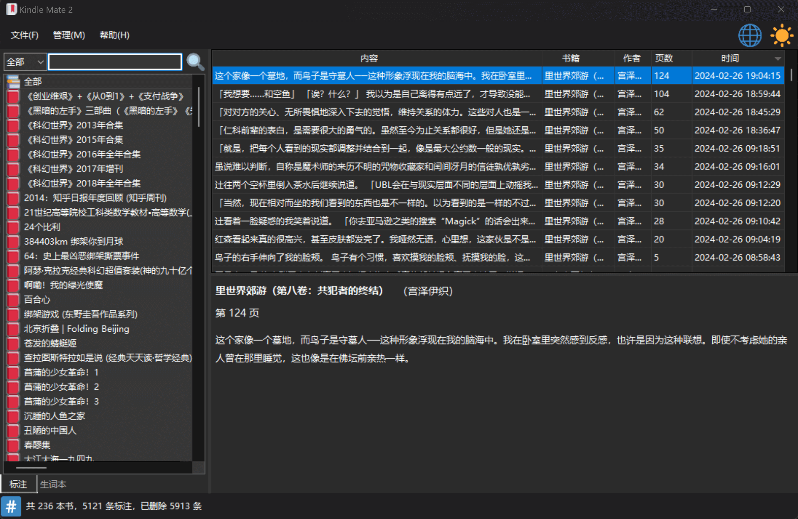
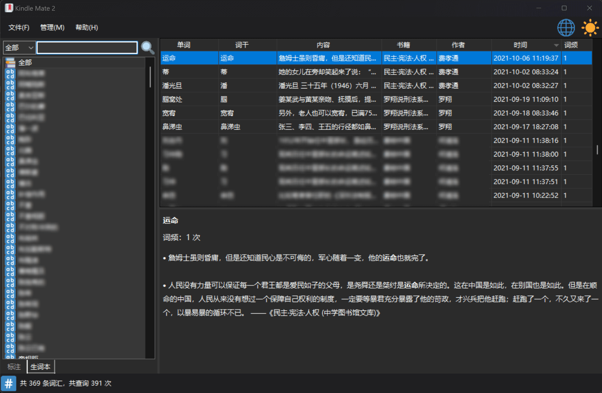

> **Kindle Mate `2`** 正在进行重大重构。本次重构将引入 多层架构（Layered Architecture），以提升代码的 可维护性、可扩展性、可测试性。
> 
> 预计完成时间：**2025年9月3日** - **2025年10月10日**。
> 
> 在此期间，将不会开发新的需求，我们会专注于架构重构与核心功能的稳定。感谢您的理解与支持！

> **Kindle Mate `2`** is undergoing a major refactoring. This refactoring introduces Layered Architecture to enhance maintainability, scalability, and testability of the codebase.
> 
> Estimated completion date: **September 3, 2025** - **October 10, 2025**.
> 
> During this period, no new feature requests will be developed. We will focus on refactoring and ensuring the stability of core functionalities. Thank you for your understanding and support!

# Kindle Mate `2`

 &ensp;  &ensp; 

**Kindle Mate 2** 是一款Kindle标注/笔记、Kindle生词本内容管理程序，旨在在 [Kindle Mate](https://web.archive.org/web/20231205072358/https://kmate.me/) 停止更新后提供替代的解决方案。

**Kindle Mate 2** is a program for managing Kindle's clippings/notes and Kindle's vocabulary list, aiming to provide an alternative solution after the [Kindle Mate](https://web.archive.org/web/20231205072358/https://kmate.me/) stopped updating.

**README** &ensp;  &ensp; 

## 系统要求

- **最低**: `Windows 7` 或更高版本
- **推荐**: `Windows 11`
- **架构**: `x86` 或 `x64`.

依赖运行时（runtime）的版本需要安装 [.NET Desktop Runtime 8.0](https://dotnet.microsoft.com/en-us/download/dotnet/8.0) 。

## 构建

`Visual Studio` 和 `C#`

### 子模块

- 克隆项目后在项目目录下执行：`git submodule update --init --recursive`

> [`lzcapp/Dark-Mode-Forms`](https://github.com/lzcapp/Dark-Mode-Forms): forked from [`BlueMystical/Dark-Mode-Forms`](https://github.com/BlueMystical/Dark-Mode-Forms)

### 项目

- `KindleMate2` (WinForm): 当前的版本
- ~`KindleMate2_WPF` (WPF): 还未完工，需要重构为WPF的UI~
      
    
    
      
    

## 特性

- [x] 导入标注（`My Clippings.txt`）
- [x] 导入生词本（`vocab.db`）
- [x] 同步已连接的Kindle设备
- [x] 编辑标注
- [x] 编辑生词本
- [x] 清理功能
- [x] 导出功能
- [x] 统计功能
- [x] 夜间模式（深色模式）
- [x] 语言切换
- [x] 搜索功能

## 截图

## 小星星⭐历史

<a href="https://star-history.com/#lzcapp/KindleMate2&Date">
 <picture>
   <source media="(prefers-color-scheme: dark)" srcset="https://api.star-history.com/svg?repos=lzcapp/KindleMate2&type=Date&theme=dark" />
   <source media="(prefers-color-scheme: light)" srcset="https://api.star-history.com/svg?repos=lzcapp/KindleMate2&type=Date" />
   
 </picture>
</a>
