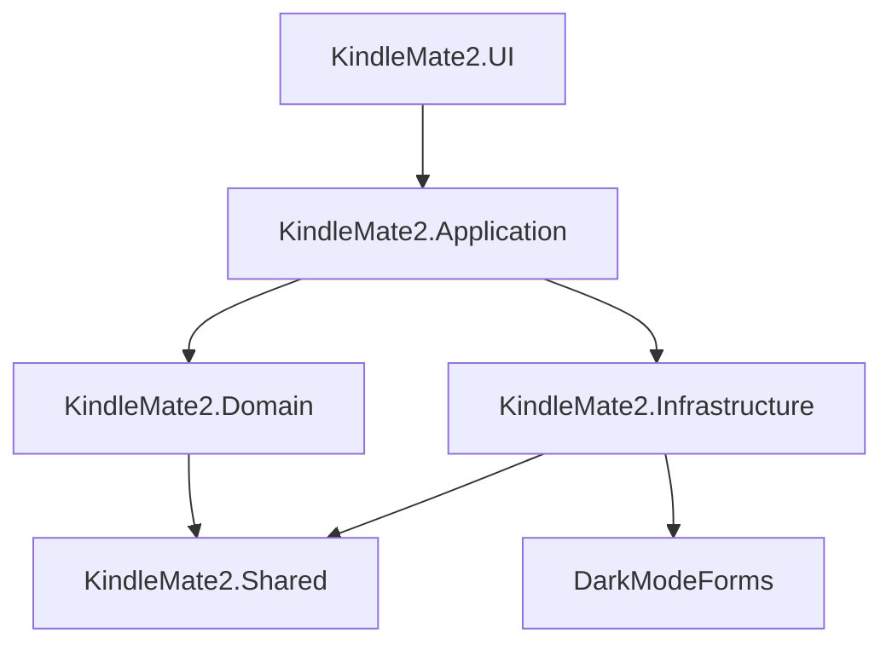

# KindleMate2 架构文档

## 项目概述
KindleMate2 是一个用于管理和优化 Kindle 电子书笔记的工具，目前正在进行重大重构，引入多层架构（Layered Architecture）以提升代码的可维护性、可扩展性和可测试性。

## 架构设计

### 1. 分层架构
项目采用多层架构设计，主要分为以下层次：

#### 1.1 表现层 (UI)
- **职责**：负责用户界面展示和用户交互。
- **项目**：`KindleMate2.UI`（基于 WPF）和 `KindleMate2`（基于 Windows Forms）。

#### 1.2 应用层 (Application)
- **职责**：协调领域层和基础设施层的交互，处理业务逻辑。
- **项目**：`KindleMate2.Application`。

#### 1.3 领域层 (Domain)
- **职责**：包含核心业务逻辑和领域模型。
- **项目**：`KindleMate2.Domain`。

#### 1.4 基础设施层 (Infrastructure)
- **职责**：提供数据访问、外部服务集成等技术支持。
- **项目**：`KindleMate2.Infrastructure`。

#### 1.5 共享层 (Shared)
- **职责**：提供跨层共享的公共组件和工具。
- **项目**：`KindleMate2.Shared`。

### 2. 技术栈
- **框架**：.NET 8.0
- **数据库**：SQLite（通过 `Microsoft.Data.Sqlite` 集成）
- **UI 技术**：WPF 和 Windows Forms
- **其他依赖**：
  - `Markdig`：用于 Markdown 解析
  - `Leisn.MarkdigToc`：用于生成目录

### 3. 项目依赖关系

### 4. 核心功能模块
- **笔记管理**：解析和优化 Kindle 电子书的笔记。
- **数据存储**：使用 SQLite 存储笔记数据。
- **用户界面**：提供多主题支持（通过 `DarkModeForms`）。

### 5. 未来计划
- 完成重构后，将专注于核心功能的稳定性和性能优化。
- 计划支持更多电子书格式的笔记管理。