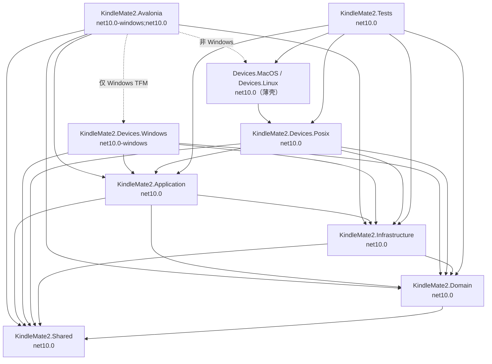

# KindleMate2 架构文档

> 最后更新：2026-09-25

## 项目概述

KindleMate2 是 Kindle 标注 / 生词本的管理与整理工具。数据来自 Kindle 设备的
`My Clippings.txt` 与 `vocab.db`，统一落在本地 SQLite 库中，供检索、编辑、
统计与导出（Markdown）。

当前形态：**Avalonia 是唯一的桌面 UI**，架构按分层组织，并已做到
**库层与设备层均跨平台**（Windows / macOS / Linux 均可构建，三平台设备同步均支持）。

---

## 架构设计

### 1. 分层架构

| 层 | 项目 | 职责 |
|---|---|---|
| 表现层 (UI) | `KindleMate2.Avalonia` | 界面与交互（Avalonia 12，无第三方 UI 库） |
| 应用层 (Application) | `KindleMate2.Application` | 协调领域与基础设施；导入 / 导出 / 维护 / 设备接口 |
| 领域层 (Domain) | `KindleMate2.Domain` | 实体与仓储接口 |
| 基础设施层 (Infrastructure) | `KindleMate2.Infrastructure` | SQLite 仓储实现、建库 / 迁移 / 备份、Markdown 导出 |
| 共享层 (Shared) | `KindleMate2.Shared` | 常量、实体、多语言资源（`Strings`） |
| 平台实现 | `KindleMate2.Devices.Windows` | Windows 专有设备实现（USB 盘符 + MTP(MediaDevices) + WMI） |
| 平台实现 | `KindleMate2.Devices.Posix` | macOS/Linux 共用的设备实现（libmtp P/Invoke + libusb 只读探测 + 卷扫描） |
| 平台壳 | `KindleMate2.Devices.MacOS` / `KindleMate2.Devices.Linux` | 上面 Posix 实现的薄壳（候选挂载根不同），均为中性 `net10.0` |
| 测试 | `KindleMate2.Tests` | 单元测试（`dotnet test`；真机/联网探测默认跳过，需环境变量开启） |

> 历史说明：早期的 WPF（`KindleMate2.UI`）与 Windows Forms（`KindleMate2`）两个壳
> 已于 2026-09-13 退役删除，`DarkModeForms` 子模块随之移除。
> **本仓库目前不含任何 git 子模块。**

### 2. 项目与目标框架

| 项目 | TFM | 说明 |
|---|---|---|
| `KindleMate2.Shared` | `net10.0` | 纯跨平台 |
| `KindleMate2.Domain` | `net10.0` | 纯跨平台 |
| `KindleMate2.Infrastructure` | `net10.0` | 纯跨平台 |
| `KindleMate2.Application` | `net10.0` | 纯跨平台 |
| `KindleMate2.Avalonia` | `net10.0-windows;net10.0` | Windows 用 `WinExe`，其他平台用 `Exe` |
| `KindleMate2.Devices.Windows` | `net10.0-windows` | 仅被 Avalonia 的 Windows TFM 引用 |
| `KindleMate2.Devices.Posix` | `net10.0` | 纯 BCL（libmtp P/Invoke + libusb 探测），macOS / Linux 共用 |
| `KindleMate2.Devices.MacOS` | `net10.0` | Posix 实现的 macOS 薄壳（`/Volumes` 挂载根） |
| `KindleMate2.Devices.Linux` | `net10.0` | Posix 实现的 Linux 薄壳（`/media`、`/run/media` 等挂载根） |
| `KindleMate2.Tests` | `net10.0` | 只引用 Application / Infrastructure / Domain，可跨平台运行 |

### 3. 项目依赖关系


```mermaid
graph TD
    UI["KindleMate2.Avalonia<br/>net10.0-windows;net10.0"] --> APP["KindleMate2.Application<br/>net10.0"]
    UI --> INF["KindleMate2.Infrastructure<br/>net10.0"]
    UI --> DOM["KindleMate2.Domain<br/>net10.0"]
    UI --> SH["KindleMate2.Shared<br/>net10.0"]
    UI -. "仅 Windows TFM" .-> DEV["KindleMate2.Devices.Windows<br/>net10.0-windows"]
    UI -. "非 Windows" .-> POS["Devices.MacOS / Devices.Linux<br/>net10.0（薄壳）"]

    APP --> DOM
    APP --> INF
    APP --> SH

    DEV --> APP
    DEV --> DOM
    DEV --> INF
    DEV --> SH

    POS --> POSIX["KindleMate2.Devices.Posix<br/>net10.0"]
    POSIX --> APP
    POSIX --> DOM
    POSIX --> INF
    POSIX --> SH

    INF --> DOM
    INF --> SH

    DOM --> SH

    T["KindleMate2.Tests<br/>net10.0"] --> APP
    T --> INF
    T --> DOM
    T --> POS
    T --> POSIX
```

### 4. 平台专有代码的边界

**原则：平台专有代码一律收敛到独立程序集，不在业务层散布条件编译。**

- Windows 专有程序集是 `KindleMate2.Devices.Windows`（USB 盘符枚举、MTP(MediaDevices)、WMI 事件监听，`net10.0-windows`，依赖 `MediaDevices` + `System.Management`）。
- macOS / Linux 的设备实现是纯 BCL 的 `KindleMate2.Devices.Posix`（`net10.0`：libmtp 的 P/Invoke 绑定、libusb 只读 USB 探测、卷扫描），由两个薄壳 `Devices.MacOS` / `Devices.Linux` 注入各自的候选挂载根；因此这两个程序集可在**任意平台**编译与单测（用例把卷根指到临时目录）。
- `Application` 只定义跨平台接口 `IDeviceManager`；三者之外的平台才落到 `Application.Services.NullDeviceManager` 兜底（如实报告"未连接"，同步操作抛 `PlatformNotSupportedException` 而不是静默失败）。
- **`IDeviceManager` 的注册由各平台壳负责**，不在 `Application/DependencyInjection.cs` 里 —— 否则 Application 就得引用平台专有程序集。Avalonia 在 `Services/DatabaseSession.cs` 内按平台选择实现。
- Avalonia 壳仅在 Windows TFM 下引用 `Devices.Windows`，因此 `KindleMate2.Devices.Windows.dll` 只出现在 `net10.0-windows` 的输出目录中。

---

## 关键组件与数据流

### `Services/DatabaseSession.cs`（UI 与业务之间的组装点）

按"当前打开的库路径"组装仓储 + 服务 + 各工厂 + `DeviceManager` / `ImportManager` /
`ExportManager`。这是绕开 `Application/DependencyInjection.cs` 中硬编码连接串的正解，
所有 UI 动作都经由它。

```
Avalonia View  →  ViewModel  →  DatabaseSession  →  Infrastructure 仓储  →  SQLite
```

### 操作反馈契约（`OperationResult`）

所有写操作返回 `OperationResult(Ok, Title, Message, Kind, FolderToOpen)`，
**VM 不弹窗**，对话框由视图层按文案弹出。成败判定沿用原版语义：

| 情况 | 判定 | 弹窗 |
|---|---|---|
| 操作返回**非空串** | 成功 | 标题=成功标题，正文=返回串 |
| 操作返回**空串** | 失败 | 弹"只有标题"的错误框 |
| 抛异常 | 失败 | 标题=失败标题，正文=`失败标题 + 换行 + 异常消息` |

`Kind` 决定弹窗类型：`Silent`（不弹，如删除成功）/ `Info`（单按钮）/
`OpenFolderPrompt`（"需要打开文件夹吗?"）。

---

## 数据库生命周期

**库路径固定为 `<当前目录>/KM2.dat`**（与原 WinForms 版一致，没有库选择器）：

1. 文件不存在 → `DatabaseHelper.CreateDatabase()` 自动建库；失败 → 错误框 + 退出。
2. `DatabaseHelper.MigrateLookupsSchemaIfNeeded()` 一次性幂等 schema 迁移，失败仅告警。
3. 进程退出（`AppDomain.ProcessExit`）→ `DatabaseHelper.BackupDatabase()` 自动备份到
   `Backups/OnExit/`，随后 `DatabaseHelper.PruneBackups()` 只保留最新 3 份。

> **退出备份为什么单独一个子目录**：它每次关闭都产生一份，而手动备份与「清洗标注文本」前的
> 保护性备份都落在 `Backups/` 根下 —— 混在一起时根目录很快被一串时间戳文件淹没，用户主动要的
> 那几份反而找不着。分开后根目录只留用户自己要的，自动产物集中一处并由保留策略统一收敛。
> 保留份数是 `AppConstants.ExitBackupKeepCount`；判定新旧用**文件名里的时间戳**而非 mtime
> （后者会被复制 / 云同步改写），这也是备份名时间戳必须走 `InvariantCulture` 的原因之一。

当前格式的 schema 由 `DatabaseHelper.CreateDatabase()` 定义（`clippings` / `lookups` /
`original_clipping_lines` / `settings` / `vocab`）。

> **旧格式库不能直接打开。** 那套关系型旧库（样本在仓库外 fixtures）虽有 `clippings` 表但**没有 `key` 列**，
> 直接打开会报 `no such column: key`。迁入旧数据的通道是
> **菜单「管理 → 导入 Kindle Mate 数据库 / 导入 Kindle Mate 2 数据库 / 导入 KMate 数据库」**（迁移，而非原地读取）。

---

## 多语言

- 全部用户可见文案走 `KindleMate2.Shared` 的 `Strings` 资源，**禁止在 XAML / VM 里写死中文**。
- 4 份资源需同步维护：`Strings.resx`（中性=简中）、`Strings.zh-hans.resx`、
  `Strings.zh-hant.resx`、`Strings.en.resx`。
- `Strings.Designer.cs` 由 `ResXFileCodeGenerator` 生成，新增键需**手工补**强类型属性；
  若在 VS 中重新生成该文件，手工增删会被覆盖 —— `.resx` 才是权威来源。
- 清理死键：UI 重构后容易残留"定义了但没人引用"的键。**不要靠肉眼扫** —— 键有两种引用
  写法（`Strings.Ui_X` 与字面量 `"Ui_X"`），漏掉后者会误删在用的键。建议写脚本审计：
  从 `Strings.Designer.cs` 取键清单，扫描 Shared 目录**之外**的全部源码判定引用，
  零引用者才删。注意 `Designer.cs` 与 `.resx` 自身包含所有键名，**必须排除出扫描范围**，
  否则审计恒为空。

---

## 技术栈

- **框架**：.NET 10（构建 SDK 与目标框架自 2026-09-14 起统一为 10.x）
- **UI**：Avalonia 12（自研 `Charts/ChartControl` 自绘图表，零第三方 UI 库；
  设计令牌 + `ThemeDictionaries` 深浅双主题）
- **数据库**：SQLite（`Microsoft.Data.Sqlite`）
- **Markdown**：`Markdig` + `Leisn.MarkdigToc`
- **设备**：`MediaDevices` + `System.Management`（仅 `Devices.Windows`）

---

## 验证手段

| 手段 | 命令 | 覆盖 |
|---|---|---|
| 只读自检 | `KindleMate2 --smoke <db> [out]` | 列表 / 详情 / 统计 / 关于 / 设置 / 搜索 / 多语言 |
| 写操作端到端 | `--ops <db> <clippings.txt> <vocab.db> <out>` | 导入 → 导出 → 备份 → 退出备份落点 → 重命名 → 删除 → 清理 → 重建 → 清空 → 空库重导 |
| 单元测试 | `dotnet test KindleMate2.Tests` | 跨平台 TFM；真机 / 联网探测默认跳过，需 `KM2_MANUAL_DEVICE_TESTS=1` / `KM2_MANUAL_NETWORK_TESTS=1` 手动开启 |
| CI（验证） | `.github/workflows/build.yml` | windows 全量构建 + 单测；ubuntu/macOS 跨平台构建 + 单测 + 启动自检 |
| CI（发布） | `.github/workflows/release.yml` | 12 个资产：Windows 6 变体 zip + Linux 4 变体 tar.gz（内含 `kindlemate2` 启动器）+ macOS 2 个 dmg（内含 .app）；发布前对 `linux-x64_runtime` 与 macOS 产物各做一次「解压/挂载即跑」自检 |

两套自检**全程在临时副本上执行**，不会改动传入的真实数据库。

---

## 已知边界与待办

- **设备支持**：Windows 走 USB 盘符 + MTP(MediaDevices)；macOS / Linux 走 USB 大容量存储 + MTP(libmtp，`Devices.Posix`)。
  macOS 发布包内嵌 libmtp/libusb；Linux 依赖系统自带的 libmtp/libusb（缺失时仅 MTP 机型不可用，USB 大容量存储照常）。
  三者之外的平台才落到 `NullDeviceManager`，设备同步不可用，其余功能完整。
- **各平台打包发布已完成**：`release.yml` 共 12 个资产 —— Windows 六变体 zip（x64/x86/arm64 ×
  框架依赖/自包含）+ Linux 四变体 tar.gz（linux-x64 / linux-arm64 × 两种）+ macOS 两个 dmg
  （macos-arm64 / macos-x64，均自包含，内含 `KindleMate2.app`）。
  ⚠️ **Linux 产物必须在 Unix runner 上发布并打包** —— 从 NTFS 打出的归档记录不出可执行位，
  解压出来是 644、运行即 permission denied；故用 `tar.gz` 且打包前 `chmod +x`。
  包内另带 `kindlemate2` 启动器：程序按「当前工作目录」定位库（与原版一致），而双击或从别处调用时
  工作目录并不在解压目录 —— 启动器先切到 XDG 数据目录（`$KINDLEMATE2_HOME`，否则
  `${XDG_DATA_HOME:-~/.local/share}/KindleMate2`）再 exec 真程序。自检也走启动器，这段逻辑同样被验到。
  **macOS 产物必须在 macOS runner 上做**（arm64 要求可执行文件签名有效，只有原生路径会签；
  iconutil / codesign / hdiutil 也只有 macOS 有）：bundle 内放一个 `launch` 脚本当 `CFBundleExecutable`，
  先 `cd` 到 `~/Library/Application Support/KindleMate2/` 再 exec 真程序 —— Finder 启动时工作目录是 `/`，
  而库路径按「当前目录」解析（与原版一致）；**不能切进 .app 内部**（更新应用会丢数据，且改动 bundle
  内容会破坏代码签名）。**签名默认只到 ad-hoc**（无 Apple 开发者账号、未公证），用户首次启动需清 quarantine；
  `release.yml` 已预留可选的 Developer ID 签名 + 公证（配置 `APPLE_CERTIFICATE_BASE64` 等 secrets 即启用，
  含 `scripts/macos-entitlements.plist`；未配置时自动回退 ad-hoc）。该正式签名路径尚未实机验证。
  另：`checksums` job 用维护者的 GPG 密钥（`GPG_PRIVATE_KEY` / `GPG_PASSPHRASE`）对 `SHA256SUMS` 做分离签名；
  `release-prep` 打的发布 tag 也用同一把密钥做 **GPG 签名**（`git tag -s`，可在本地 `git tag --verify` 验证）。
  **三平台数据目录约定**：Windows = 程序所在目录（同旧版，双击 exe 的默认工作目录）；
  Linux = `~/.local/share/KindleMate2/`；macOS = `~/Library/Application Support/KindleMate2/`。
  库文件与 `Backups`/`Imports`/`Temp`/`Exports` 都在这之下（由启动器切换工作目录实现，程序本身不改）。
  单文件打包（`PublishSingleFile`）仍未启用（未实机验证）。
- **版本号来自 git tag**：`KindleMate2.Avalonia.csproj` 不再维护 `<Version>`；构建时由 MSBuild 目标
  `Km2SetVersionFromGitTag` 取**最新的日期式 tag**（去前导零）作为程序集 / 文件 / 信息版本，发布时
  `release.yml` 用 `-p:Version` 覆盖。因此**发版无需在 main 提交任何版本号**（main 有必需状态检查，直推会被拒）。
- **构建 SDK 必须 ≥ 10**：Avalonia 12 的 XAML 源生成器引用 `Microsoft.CodeAnalysis 4.14`，
  在 SDK 8/9 上会被 Roslyn **静默跳过**（只发 CS9057 警告），表现为每个 `.axaml.cs` 满屏
  `CS0103: InitializeComponent 不存在`。
- **自动更新**：Avalonia 壳内置了更新检查与安装（`Application/Services/UpdateChecker` + `UpdateInstaller`，数据源为本仓库的 GitHub Releases，下载后按发布页的 `SHA256SUMS` 做 SHA-256 完整性校验）。站点 AppCast（`update_*.xml`）不在本仓库，发版后需手动指向新的 Release。
- 行为对齐原则：**UI 与跨平台可变，功能与行为须与已退役的原 WinForms 版完全一致**。
  少数经用户确认的例外已在代码注释与提交说明中标注。
