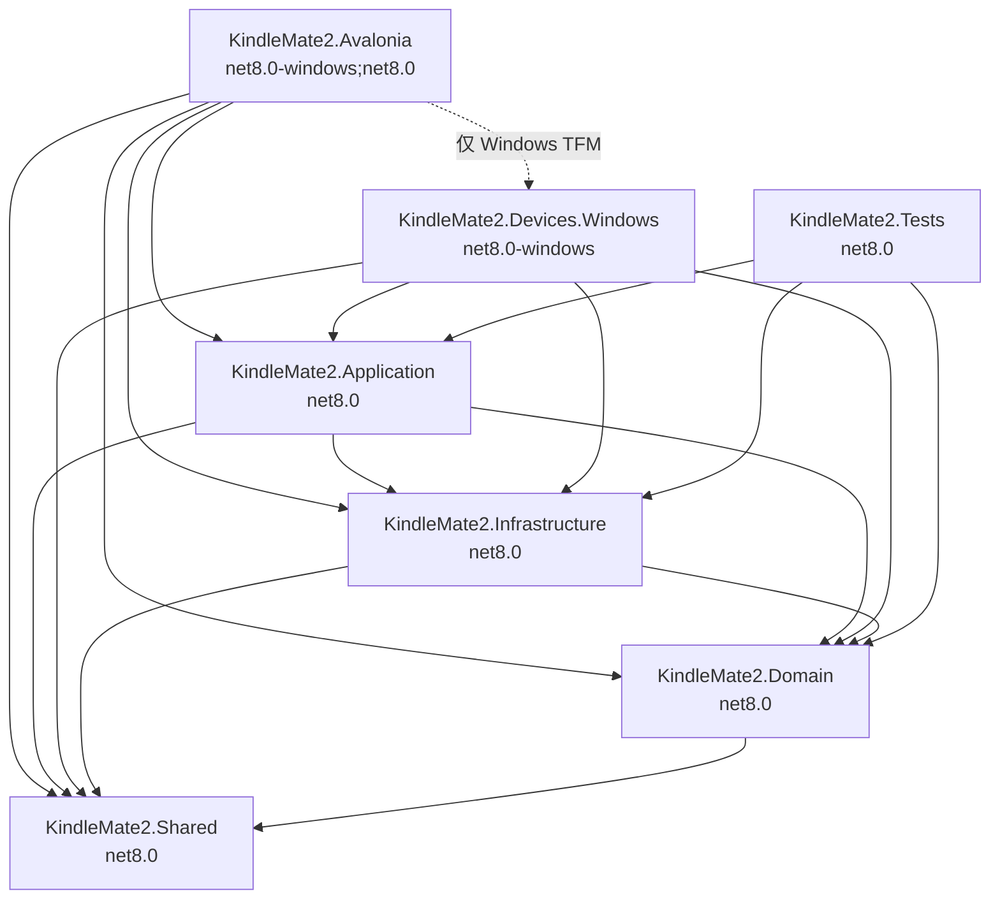

# KindleMate2 架构文档

> 最后更新：2026-09-13

## 项目概述

KindleMate2 是 Kindle 标注 / 生词本的管理与整理工具。数据来自 Kindle 设备的
`My Clippings.txt` 与 `vocab.db`，统一落在本地 SQLite 库中，供检索、编辑、
统计与导出（Markdown）。

当前形态：**Avalonia 是唯一的桌面 UI**，架构按分层组织，并已做到
**库层跨平台**（Windows / macOS / Linux 均可构建，Windows 具备完整设备支持）。

---

## 架构设计

### 1. 分层架构

| 层 | 项目 | 职责 |
|---|---|---|
| 表现层 (UI) | `KindleMate2.Avalonia` | 界面与交互（Avalonia 12，无第三方 UI 库） |
| 应用层 (Application) | `KindleMate2.Application` | 协调领域与基础设施；导入 / 导出 / 维护 / 设备接口 |
| 领域层 (Domain) | `KindleMate2.Domain` | 实体与仓储接口 |
| 基础设施层 (Infrastructure) | `KindleMate2.Infrastructure` | SQLite 仓储实现、建库 / 迁移 / 备份、Markdown 导出 |
| 共享层 (Shared) | `KindleMate2.Shared` | 常量、实体、多语言资源（`Strings`） |
| 平台实现 | `KindleMate2.Devices.Windows` | Windows 专有设备实现（USB 盘符 + MTP + WMI） |
| 测试 | `KindleMate2.Tests` | 单元测试（83 个） |

> 历史说明：早期的 WPF（`KindleMate2.UI`）与 Windows Forms（`KindleMate2`）两个壳
> 已于 2026-09-13 退役删除，`DarkModeForms` 子模块随之移除。
> **本仓库目前不含任何 git 子模块。**

### 2. 项目与目标框架

| 项目 | TFM | 说明 |
|---|---|---|
| `KindleMate2.Shared` | `net8.0` | 纯跨平台 |
| `KindleMate2.Domain` | `net8.0` | 纯跨平台 |
| `KindleMate2.Infrastructure` | `net8.0` | 纯跨平台 |
| `KindleMate2.Application` | `net8.0` | 纯跨平台 |
| `KindleMate2.Avalonia` | `net8.0-windows;net8.0` | Windows 用 `WinExe`，其他平台用 `Exe` |
| `KindleMate2.Devices.Windows` | `net8.0-windows` | 仅被 Avalonia 的 Windows TFM 引用 |
| `KindleMate2.Tests` | `net8.0` | 只引用 Application / Infrastructure / Domain，可跨平台运行 |

### 3. 项目依赖关系


```mermaid
graph TD
    UI["KindleMate2.Avalonia<br/>net8.0-windows;net8.0"] --> APP["KindleMate2.Application<br/>net8.0"]
    UI --> INF["KindleMate2.Infrastructure<br/>net8.0"]
    UI --> DOM["KindleMate2.Domain<br/>net8.0"]
    UI --> SH["KindleMate2.Shared<br/>net8.0"]
    UI -. "仅 Windows TFM" .-> DEV["KindleMate2.Devices.Windows<br/>net8.0-windows"]

    APP --> DOM
    APP --> INF
    APP --> SH

    DEV --> APP
    DEV --> DOM
    DEV --> INF
    DEV --> SH

    INF --> DOM
    INF --> SH

    DOM --> SH

    T["KindleMate2.Tests<br/>net8.0"] --> APP
    T --> INF
    T --> DOM
```

### 4. 平台专有代码的边界

**原则：平台专有代码一律收敛到独立程序集，不在业务层散布条件编译。**

- 唯一平台专有程序集是 `KindleMate2.Devices.Windows`（USB 盘符枚举、MTP、WMI 事件监听）。
- `Application` 只定义跨平台接口 `IDeviceManager`；非 Windows 平台使用
  `Application.Services.NullDeviceManager` 兜底（如实报告"未连接"，同步操作抛
  `PlatformNotSupportedException` 而不是静默失败）。
- **`IDeviceManager` 的注册由各平台壳负责**，不在 `Application/DependencyInjection.cs` 里 ——
  否则 Application 就得引用 Windows 专有程序集。Avalonia 在
  `Services/DatabaseSession.cs` 内按 `#if WINDOWS` 选择实现。
- Avalonia 壳仅在 Windows TFM 下引用设备项目，因此 `KindleMate2.Devices.Windows.dll`
  只出现在 `net8.0-windows` 的输出目录中。

---

## 关键组件与数据流

### `Services/DatabaseSession.cs`（UI 与业务之间的组装点）

按"当前打开的库路径"组装仓储 + 服务 + 各工厂 + `DeviceManager` / `ImportManager` /
`ExportManager`。这是绕开 `Application/DependencyInjection.cs` 中硬编码连接串的正解，
所有 UI 动作都经由它。

```
Avalonia View  →  ViewModel  →  DatabaseSession  →  Infrastructure 仓储  →  SQLite
```

### 操作反馈契约（`OperationResult`）

所有写操作返回 `OperationResult(Ok, Title, Message, Kind, FolderToOpen)`，
**VM 不弹窗**，对话框由视图层按文案弹出。成败判定沿用原版语义：

| 情况 | 判定 | 弹窗 |
|---|---|---|
| 操作返回**非空串** | 成功 | 标题=成功标题，正文=返回串 |
| 操作返回**空串** | 失败 | 弹"只有标题"的错误框 |
| 抛异常 | 失败 | 标题=失败标题，正文=`失败标题 + 换行 + 异常消息` |

`Kind` 决定弹窗类型：`Silent`（不弹，如删除成功）/ `Info`（单按钮）/
`OpenFolderPrompt`（"需要打开文件夹吗?"）。

---

## 数据库生命周期

**库路径固定为 `<当前目录>/KM2.dat`**（与原 WinForms 版一致，没有库选择器）：

1. 文件不存在 → `DatabaseHelper.CreateDatabase()` 自动建库；失败 → 错误框 + 退出。
2. `DatabaseHelper.MigrateLookupsSchemaIfNeeded()` 一次性幂等 schema 迁移，失败仅告警。
3. 进程退出（`AppDomain.ProcessExit`）→ `DatabaseHelper.BackupDatabase()` 自动备份。

当前格式的 schema 由 `DatabaseHelper.CreateDatabase()` 定义（`clippings` / `lookups` /
`original_clipping_lines` / `settings` / `vocab`）。

> **旧格式库不能直接打开。** 原版 Kindle Mate 的库虽有 `clippings` 表但**没有 `key` 列**，
> 直接打开会报 `no such column: key`。迁入旧数据的正确通道是
> **菜单「管理 → 导入 Kindle Mate 数据库 / 导入 KMate 数据库」**（迁移，而非原地读取）。

---

## 多语言

- 全部用户可见文案走 `KindleMate2.Shared` 的 `Strings` 资源，**禁止在 XAML / VM 里写死中文**。
- 4 份资源需同步维护：`Strings.resx`（中性=简中）、`Strings.zh-hans.resx`、
  `Strings.zh-hant.resx`、`Strings.en.resx`。
- `Strings.Designer.cs` 由 `ResXFileCodeGenerator` 生成，新增键需**手工补**强类型属性；
  若在 VS 中重新生成该文件，手工增删会被覆盖 —— `.resx` 才是权威来源。
- 清理死键：UI 重构后容易残留"定义了但没人引用"的键。**不要靠肉眼扫** —— 键有两种引用
  写法（`Strings.Ui_X` 与字面量 `"Ui_X"`），漏掉后者会误删在用的键。建议写脚本审计：
  从 `Strings.Designer.cs` 取键清单，扫描 Shared 目录**之外**的全部源码判定引用，
  零引用者才删。注意 `Designer.cs` 与 `.resx` 自身包含所有键名，**必须排除出扫描范围**，
  否则审计恒为空。

---

## 技术栈

- **框架**：.NET 8
- **UI**：Avalonia 12（自研 `Charts/ChartControl` 自绘图表，零第三方 UI 库；
  设计令牌 + `ThemeDictionaries` 深浅双主题）
- **数据库**：SQLite（`Microsoft.Data.Sqlite`）
- **Markdown**：`Markdig` + `Leisn.MarkdigToc`
- **设备**：`MediaDevices` + `System.Management`（仅 `Devices.Windows`）

---

## 验证手段

| 手段 | 命令 | 覆盖 |
|---|---|---|
| 只读自检 | `KindleMate2.Avalonia --smoke <db> [out]` | 列表 / 详情 / 统计 / 关于 / 设置 / 搜索 / 多语言 |
| 写操作端到端 | `--ops <db> <clippings.txt> <vocab.db> <out>` | 导入 → 导出 → 备份 → 重命名 → 删除 → 清理 → 重建 → 清空 → 空库重导 |
| 单元测试 | `dotnet test KindleMate2.Tests` | 83 个用例，跨平台 TFM |
| CI | `.github/workflows/build.yml` | windows 全量构建 + 单测；ubuntu/macOS 跨平台构建 + 单测 + 启动自检 |

两套自检**全程在临时副本上执行**，不会改动传入的真实数据库。

---

## 已知边界与待办

- **非 Windows 的 Kindle 设备支持**尚未实现（`NullDeviceManager` 兜底）；
  macOS / Linux 的挂载点与 libmtp 需要各自实现。
- **各平台打包发布**未完成：`release.yml` 目前只产出 Windows 六变体（x64/x86/arm64 ×
  框架依赖/自包含），且已移除单文件打包（待实机验证）。
- **自动更新**（AutoUpdater.NET + AppCast）尚未迁移到 Avalonia 壳。
- 行为对齐原则：**UI 与跨平台可变，功能与行为须与已退役的原 WinForms 版完全一致**。
  少数经用户确认的例外已在代码注释与提交说明中标注。
